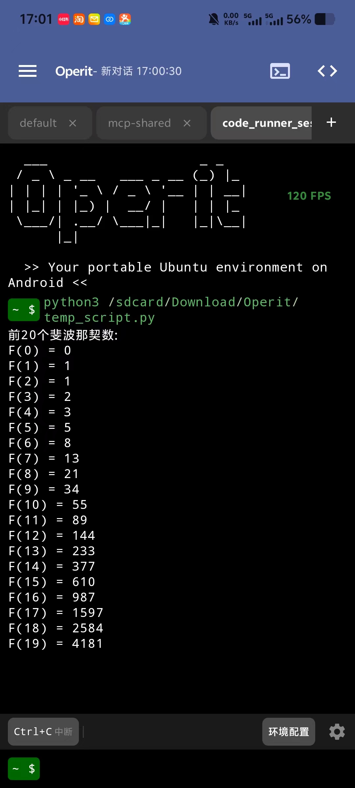
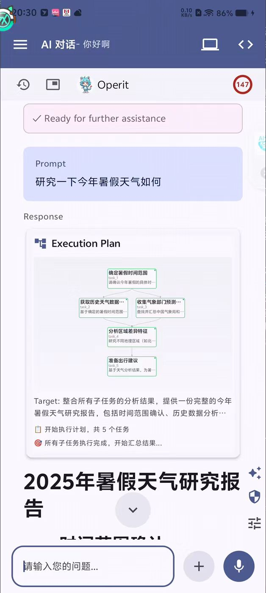
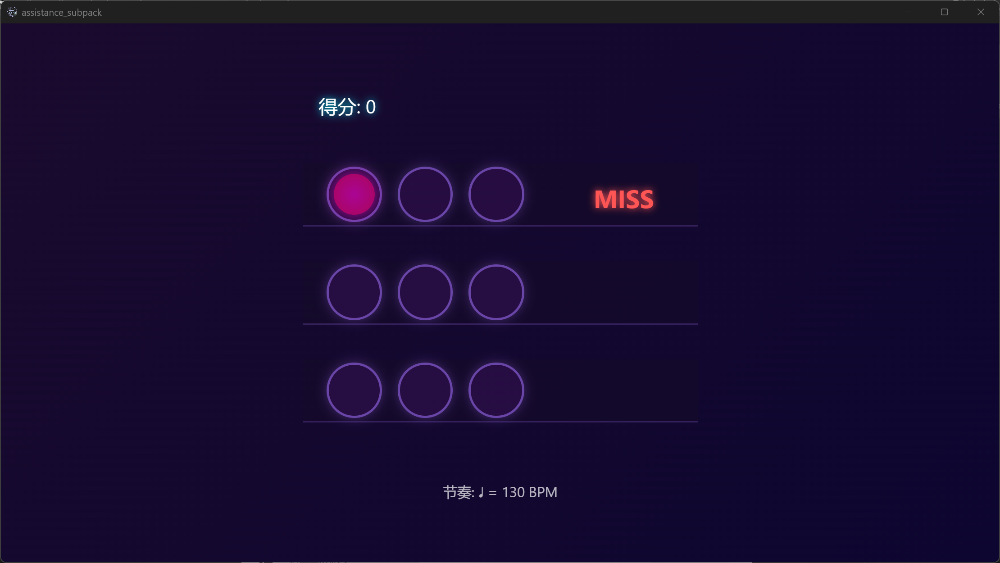
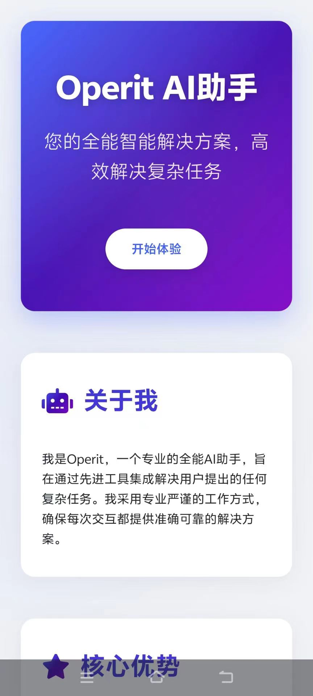
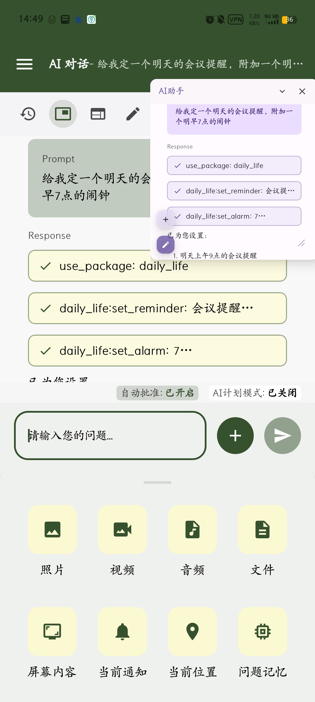
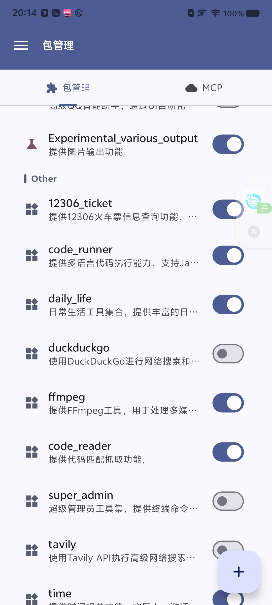
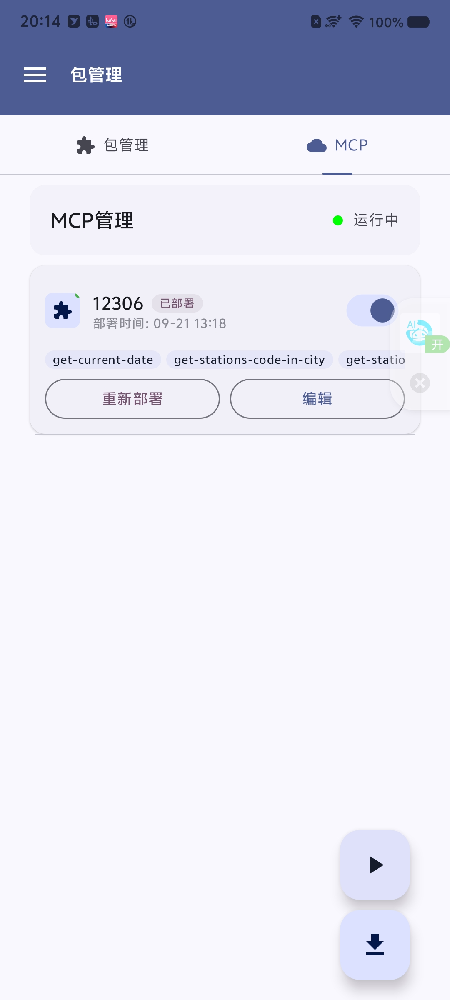

  <a href="README.md">中文版</a> | English

  
  
  
   
  
  
  

  
  <h1>Operit AI - Your Intelligent Assistant</h1>
  
📱 <b>The first fully functional, standalone AI assistant for mobile devices with powerful tool-calling capabilities.</b> 📱

  

    
    
    
    
  

  
<b>🚀 We need your help to promote this application and gain more visibility! 🚀</b>

## 🌟 Project Introduction

**Operit AI** is the first fully functional AI assistant application on mobile devices that runs **completely standalone** (except for external API calls) on your Android device. It features powerful **tool-calling capabilities**, **Deep Search**, a **Memory Vault**, and supports highly customizable features like **User Personality** and **Character Cards**. It is more than just a chat interface; it is an **all-in-one assistant** deeply integrated with Android permissions and various tools. Now with a built-in **Ubuntu 24 Environment**, it provides unprecedented functionality.

## 🛠️ Rich Built-in Tools

Operit comes with over 40 powerful built-in tools, enabling the AI assistant to interact deeply with your device:

- **Built-in Ubuntu 24 Environment**: Stably run various Linux commands and MCPs to achieve complex automation tasks.
- **File System Tools**: Read/write files, search files, compress/decompress, convert formats, etc.
- **HTTP Tools**: Make web requests, access web pages, upload/download files, etc.
- **System Operation Tools**: Manage system settings, install apps, control app execution, etc.
- **Media Processing Tools**: Video conversion, encoding/decoding, frame extraction, etc.

These built-in tools, combined with a rich plugin system, allow Operit to handle a wide range of tasks from simple to complex, truly delivering an all-powerful mobile AI assistant experience.

## 🚀 Core Feature Showcase

### 🗣️ All-New Voice Interaction Experience

Operit AI introduces a revolutionary voice interaction feature. It's no longer just about simple voice commands; it's an intelligent partner capable of **natural, continuous conversations**. By combining powerful local and cloud-based voice technologies, you can communicate fluently with the AI, achieving comprehensive voice control for everything from casual chats and queries to executing complex tasks.

### 🖥️ Built-in Ubuntu 24 Environment

Operit AI includes a complete Ubuntu 24 environment, meaning you can have a powerful, desktop-class Linux system on your phone. This provides unprecedented support for the **stable operation of MCPs (Method, Coder, and Plan)**, allowing you to execute complex code tasks and automation workflows securely and efficiently without worrying about compatibility or environmental issues.

### 🎨 Powerful Theming and Personalization

Create an AI assistant that's uniquely yours! Operit AI offers powerful theme customization features, allowing you to tweak almost every corner of the interface—from colors and fonts to layouts—to create a one-of-a-kind visual style. What's more, you can shape the AI's personality and speaking style through **User Personality** and **Character Card** features, making it your most personal companion.

### 🧠 Deep Search and Memory Vault

Forget the hassle of information overload. Operit AI features a powerful **Deep Search** function that can quickly find the information you need on your device and in your conversation history. The unique **Memory Vault** feature allows the AI to remember your preferences, important information, and common habits, providing more personalized and context-aware intelligent services.

### 🌐 Web Development Functionality

Design web pages on your phone and export them as standalone apps, useful for personal portfolios or creating utility tools.

  

    <!-- Desktop Screenshot -->
    <figure style="margin-bottom: 15px;">
      
      <figcaption style="font-size:0.8em; text-align:center; color:#555; margin-top: 5px;">I used AI to create a music game with a built-in fast-paced background music</figcaption>
    </figure>
    <!-- Mobile Screenshots -->
    

      <figure style="display: inline-block; margin: 0 5px; vertical-align: top;">
        
        <figcaption style="font-size:0.8em; text-align:center; color:#555; margin-top: 5px;">Building the site via chat.</figcaption>
      </figure>
      <figure style="display: inline-block; margin: 0 5px; vertical-align: top;">
        
        <figcaption style="font-size:0.8em; text-align:center; color:#555; margin-top: 5px;">Previewing the site on mobile.</figcaption>
      </figure>
    

  

  
👆 Web application development, supporting export as standalone apps and various interactive experiences.

### 📱 Floating Window & Attachment Functionality

Operit AI supports a floating window mode and convenient attachment uploads, allowing you to call AI functions and share files anytime.

  

    
  

  
👆 Access via floating window anytime, with convenient attachment sharing.

### 🔌 Powerful Plugin System

Operit AI offers a rich plugin ecosystem. Combined with built-in tools, it can handle a variety of functions, from daily utilities to code execution, map queries, and system management. Accomplish complex tasks that used to require multiple steps with a single natural language sentence.

  

    
    
  

  
👆 A rich plugin ecosystem and built-in tools for a wide range of functions at your fingertips.

## 🚀 Quick Start

> **For a detailed installation guide and rich usage examples, please check out our 👉 [User Guide](https://aaswordman.github.io/OperitWeb)**

- **System Requirements**: Android 8.0+ (API 26+), 4GB+ RAM recommended, 200MB+ storage space.
- **Installation Steps**:
  1. Download the latest APK from the [Release Page](https://github.com/AAswordman/Operit/releases).
  2. Install and launch the app, then follow the in-app guide to complete the setup.
  3. Start enjoying the convenience of an AI assistant!

## 👨‍💻 Open Source & Collaboration

Join the Operit open-source ecosystem! We welcome all types of contributors, whether you're developing third-party scripts, MCP plugins, or participating in the core development.

For this repository, you must download some dependency libraries from `https://drive.google.com/drive/folders/1g-Q_i7cf6Ua4KX9ZM6V282EEZvTVVfF7?usp=sharing` and place them in folders with .keep files

**Check out our [Contribution Guide](docs/CONTRIBUTING.md) and [Script Development Guide (Chinese)](docs/SCRIPT_DEV_GUIDE.md) to learn how to get involved.**

## 💖 Contributors

Thanks to all who have contributed to Operit AI!

## 📝 Feedback (Issues)

If you encounter any problems or have suggestions for new features, we welcome you to submit an Issue!

**Issue Submission Guidelines:**

- Clearly describe the problem/suggestion, providing detailed steps to reproduce if possible.
- Include relevant information such as your device model and system version.
- If possible, provide screenshots or screen recordings to help us understand the issue.

We do our best to address every reasonable issue, but please understand that open-source maintainers have limited time and energy. Also, we do not tolerate personal attacks or disrespectful comments; such issues will be closed immediately.

## 📞 Contact Us

- Email: aaswordsman@foxmail.com
- For issues: [Issue Tracker](https://github.com/AAswordman/Operit/issues)

## 📄 License

This project is licensed under a **modified GPLv3 License**:

1. This project is open-sourced based on the [GNU General Public License v3.0](https://www.gnu.org/licenses/gpl-3.0.html).
2. **Additional Requirements**:
   - All derivative works using or modifying this project's code **must** be open-sourced on one of the following platforms: GitHub, GitLab, or Gitee.
   - The README file of the derivative work **must** clearly state the original project's address: `https://github.com/AAswordman/Operit`
   - These additional requirements are intended to ensure that the community can track and review all derivative works, prevent malicious modifications, and provide users with greater security.

For full license details, please see the [LICENSE](LICENSE) file. If you plan to use this project's code, please ensure you understand and comply with the above requirements.

## 📝 TODO List

Here are the features we are planning:

- Enhance the voice conversation system with support for continuous dialogue and a richer variety of TTS voices.
- Implement a more user-friendly interactive interface.
- Address the excellent suggestions in the issues.
- Promotion! Promotion! Promotion!
- Support for multiple languages.

## 🐛 Known Bugs

Please visit the [Issue Tracker](https://github.com/AAswordman/Operit/issues) to see the latest list of known issues.

If you find any other bugs, please let us know by submitting an issue! We'll do our best to fix them.